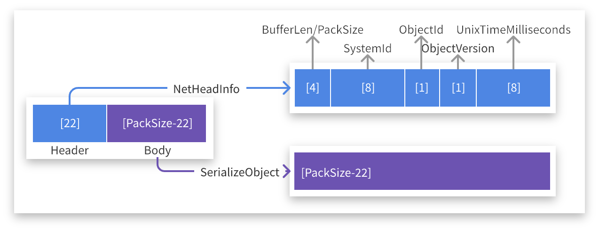

# CodeWF.EventBus.Socket

简体中文 | [English](README.md)

**使用Socket实现的分布式事件总线，支持CQRS，不依赖第三方MQ。**

`CodeWF.EventBus.Socket` 是一个轻量级的、基于Socket的分布式事件总线系统，旨在简化分布式架构中的事件通信。它允许进程之间通过发布/订阅模式进行通信，无需依赖外部消息队列服务。

**Command**


**Query**


## 特性

- **轻量级**：不依赖任何外部MQ服务，减少了系统复杂性和依赖。

- **高性能**：基于Socket的直接通信，提供低延迟、高吞吐量的消息传递。

- **灵活性**：支持自定义事件类型和消息处理器，易于集成到现有系统中。

- **可扩展性**：支持多客户端连接，适用于分布式系统环境。

## 通信协议

通过` TCP` 协议进行数据交互，协议包结构如下：



## 安装

通过`NuGet`包管理器安装`CodeWF.EventBus.Socket`：

```bash
Install-Package CodeWF.EventBus.Socket
```

## 服务端使用

### 运行事件服务

在服务端代码中，创建并启动`EventServer`实例以监听客户端连接和事件：

```csharp
using CodeWF.EventBus.Socket;

// 创建事件服务器实例
IEventServer eventServer = new EventServer();

// 启动事件服务器，监听指定IP和端口
eventServer.Start("127.0.0.1", 9100);
```

### 停止事件服务

当不再需要事件服务时，调用`Stop`方法以优雅地关闭服务器：

```csharp
eventServer.Stop();
```

## 客户端使用

### 连接事件服务

在客户端代码中，创建`EventClient`实例并连接到事件服务器：

```csharp
using CodeWF.EventBus.Socket;

// 创建事件客户端实例
IEventClient eventClient = new EventClient();

// 连接到事件服务器，使用eventClient.ConnectStatus检查连接状态
eventClient.Connect("127.0.0.1", 9100));
```

### 订阅事件

订阅特定类型的事件，并指定事件处理函数：

```csharp
eventClient.Subscribe<NewEmailCommand>("event.email.new", ReceiveNewEmailCommand);

private void ReceiveNewEmail(NewEmailCommand command)
{
    // 处理新邮件通知
    Console.WriteLine($"收到新邮件，主题是{message.Subject}");
}
```

### 发布命令(Command)

发布事件到指定的主题，供已订阅的客户端处理：

```csharp
// 发布新邮件通知事件
eventClient.Publish("event.email.new", new NewEmailCommand { Subject = "恭喜您中Github一等奖", Content = "我们很开心，您在2024年7月...", SendTime = new DateTime(2024, 7, 27) });
```

### 查询(Query)

查询指定主题，需要有接收查询端订阅相同的主题（即生产者），收到请求后，再以相同的主题发布查询结果：

```csharp
eventClient.Subscribe<EmailQuery>("event.email.query", ReceiveEmailQuery);

private void ReceiveEmailQuery(EmailQuery query)
{
    // 执行查询请求，准备查询结果
    var response = new EmailQueryResponse { Emails = EmailManager.QueryEmail(request.Subject) };
    
    // 以相同的主题，发布查询结果
    if (_eventClient!.Publish("event.email.query", response,
        out var errorMessage))
    {
        Logger.Info($"Response query result: {response}");
    }
    else
    {
        Logger.Error($"Response query failed: {errorMessage}");
    }
}
```

其他端可使用相同的主题查询（即消费者）：

```csharp
var response = _eventClient!.Query<EmailQuery, EmailQueryResponse>("event.email.query",
    new EmailQuery() { Subject = "Account" },
    out var errorMessage);
if (string.IsNullOrWhiteSpace(errorMessage) && response != null)
{
    Logger.Info($"Query event.email.query, result: {response}");
}
else
{
    Logger.Error(
        $"Query event.email.query failed: [{errorMessage}]");
}
```


### 取消订阅事件

不再需要接收某类事件时，可以取消订阅：

```csharp
eventClient.Unsubscribe<NewEmailNotification>("event.email.new", ReceiveNewEmail);
```

### 断开事件服务

完成事件处理或需要断开与服务器的连接时，调用`Disconnect`方法：

```csharp
eventClient.Disconnect();
Console.WriteLine("断开与事件服务的连接");
```

## 注意事项

- 确保服务端和客户端使用的地址和端口号一致，并且端口未被其他服务占用。
- 在生产环境中，服务端应配置为监听公共IP地址或适当的网络接口。
- 考虑到网络异常和服务重启等情况，客户端可能需要实现重连逻辑。
- 根据实际需求，可以扩展`EventServer`和`EventClient`类以支持更复杂的功能，如消息加密、认证授权等。