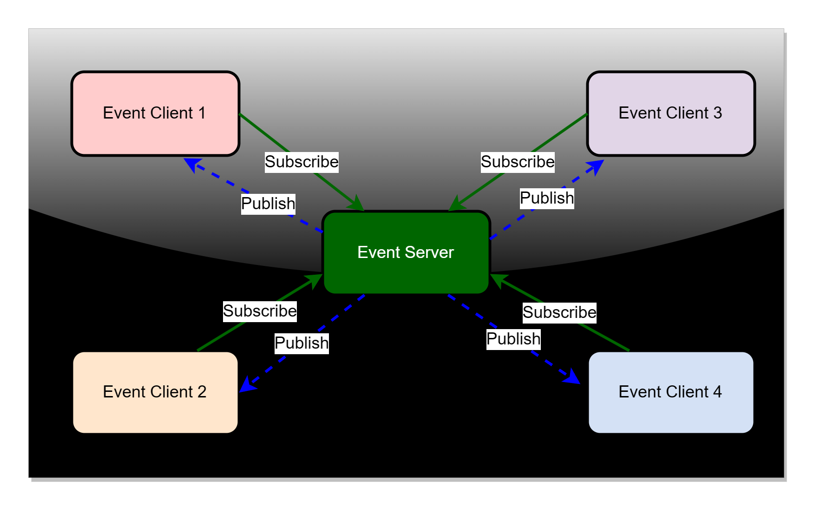
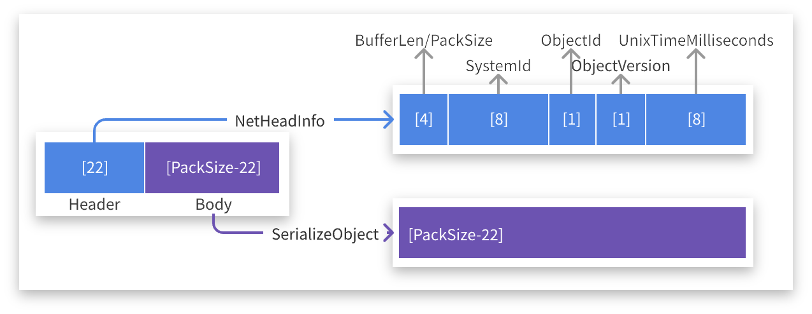

# CodeWF.EventBus.Socket
English | [简体中文](README-zh_CN.md)

**Distributed Event Bus Implemented with Socket, Without Relying on Third-Party MQ**

`CodeWF.EventBus.Socket` is a lightweight, Socket-based distributed event bus system designed to simplify event communication in distributed architectures. It allows processes to communicate via a publish/subscribe pattern without relying on external message queue services.



## Features

- **Lightweight**: No dependency on external MQ services, reducing system complexity and dependencies.
- **High Performance**: Direct communication based on Socket, providing low-latency, high-throughput message delivery.
- **Flexibility**: Supports custom event types and message handlers, making it easy to integrate into existing systems.
- **Scalability**: Supports multiple client connections, suitable for distributed system environments.

## Protocols

Data interaction through the `TCP` protocol, the protocol packet structure is as follows：



## Installation

Install `CodeWF.EventBus.Socket` via the `NuGet` Package Manager:

```bash
Install-Package CodeWF.EventBus.Socket
```

## Server Usage

### Running the Event Service

In your server code, create and start an `EventServer` instance to listen for client connections and events.

```csharp
using CodeWF.EventBus.Socket;

// Create an instance of the event server
IEventServer eventServer = new EventServer();

// Start the event server, listening on a specified IP and port
eventServer.Start("127.0.0.1", 9100);
```

### Stopping the Event Service

When the event service is no longer needed, call the `Stop` method to gracefully shut down the server.

```csharp
eventServer.Stop();
```

## Client Usage

### Connecting to the Event Service

In your client code, create an `EventClient` instance and connect to the event server.

```csharp
using CodeWF.EventBus.Socket;

// Create an instance of the event client
IEventClient eventClient = new EventClient();

// Connect to the event server, use eventClient.ConnectStatus Check connection status
eventClient.Connect("127.0.0.1", 9100);
```

### Subscribing to Events

Subscribe to a specific type of event and specify an event handler function.

```csharp
eventClient.Subscribe<NewEmailNotification>("event.email.new", ReceiveNewEmail);

private void ReceiveNewEmail(NewEmailNotification message)
{
    // Handle new email notification
    Console.WriteLine($"Received new email with subject: {message.Subject}");
}
```

### Publishing Events

Publish an event to a specified topic for subscribed clients to process.

```csharp
// Publish a new email notification event
eventClient.Publish("event.email.new", new NewEmailNotification { Subject = "Congratulations on Winning the GitHub First Prize", Content = "We're thrilled to inform you that you've won...", SendTime = new DateTime(2024, 7, 27) });
```

### Unsubscribing from Events

When you no longer need to receive a certain type of event, you can unsubscribe.

```csharp
eventClient.Unsubscribe<NewEmailNotification>("event.email.new", ReceiveNewEmail);
```

### Disconnecting from the Event Service

When you've finished processing events or need to disconnect from the server, call the `Disconnect` method.

```csharp
eventClient.Disconnect();
Console.WriteLine("Disconnected from the event service");
```

## Notes

- Ensure that the server and client use consistent addresses and port numbers, and that the port is not occupied by other services.
- In production environments, the server should be configured to listen on a public IP address or an appropriate network interface.
- Consider implementing reconnection logic in clients to handle network disruptions and service restarts.
- Depending on your requirements, you can extend the `EventServer` and `EventClient` classes to support more complex features, such as message encryption, authentication, and authorization.