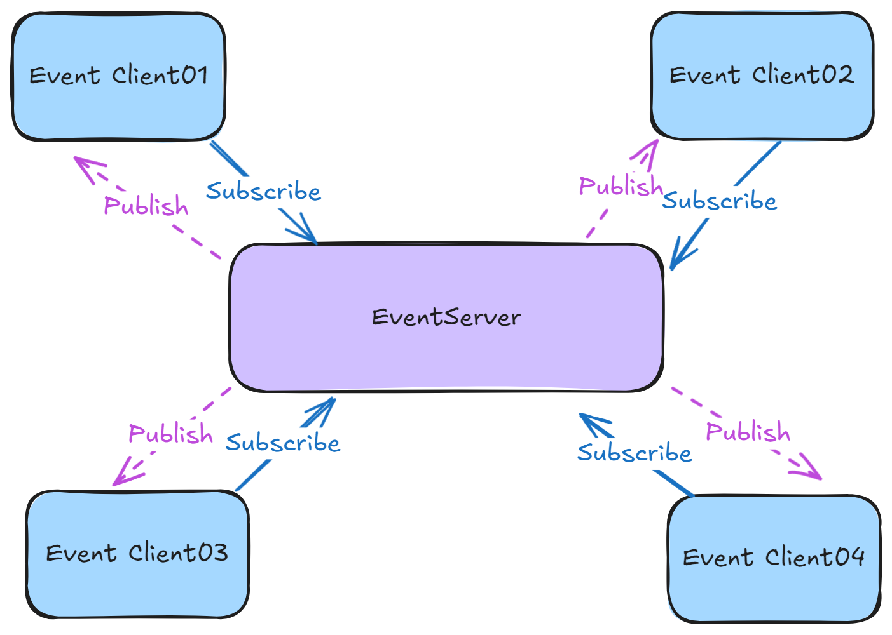
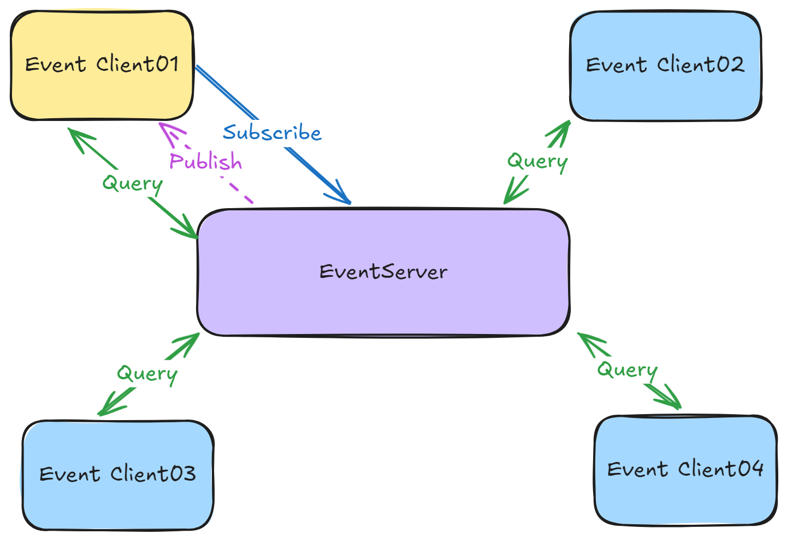
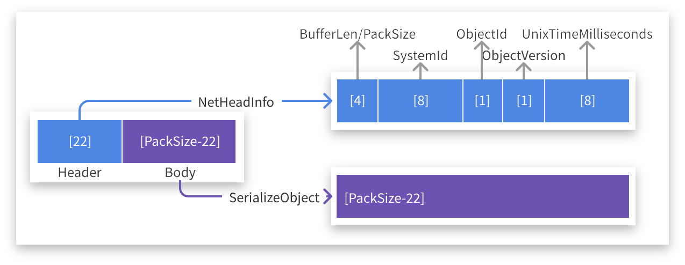

# CodeWF.EventBus.Socket

English | [简体中文](README-zh_CN.md)

[](https://www.nuget.org/packages/CodeWF.EventBus.Socket/)
[](https://www.nuget.org/packages/CodeWF.EventBus.Socket/)
[](LICENSE)

`CodeWF.EventBus.Socket` is a lightweight TCP event bus for C# processes. It provides Publish/Subscribe messaging and Query-style request/response over raw sockets, so local processes or lightweight services can communicate without introducing RabbitMQ, Kafka, Redis, or other external MQ infrastructure.





## Highlights

- TCP socket transport based on `CodeWF.NetWeaver`
- Publish/Subscribe for cross-process notifications
- Query/response flow on the same subject
- Query correlation by request `TaskId`, including concurrent queries on the same subject
- No external MQ dependency
- Demo application in `src/EventBusDemo`

## Installation

```bash
dotnet add package CodeWF.EventBus.Socket
```

or

```powershell
Install-Package CodeWF.EventBus.Socket
```

## Quick Start

### Start the server

```csharp
using CodeWF.EventBus.Socket;

IEventServer eventServer = new EventServer();
await eventServer.StartAsync("127.0.0.1", 9100);
```

### Connect a client

```csharp
using CodeWF.EventBus.Socket;

IEventClient eventClient = new EventClient();
await eventClient.ConnectAsync("127.0.0.1", 9100);
```

### Subscribe and publish

```csharp
eventClient.Subscribe<NewEmailCommand>("event.email.new", command =>
{
    Console.WriteLine($"Received: {command.Subject}");
});

eventClient.Publish("event.email.new", new NewEmailCommand
{
    Subject = "Welcome",
    Content = "Your account is ready",
    SendTime = DateTime.Now
}, out _);
```

### Query and respond

```csharp
eventClient.Subscribe<EmailQuery>("event.email.query", query =>
{
    var response = new EmailQueryResponse
    {
        Emails = EmailManager.QueryEmail(query.Subject)
    };

    eventClient.Publish("event.email.query", response, out _);
});

var result = await eventClient.QueryAsync<EmailQuery, EmailQueryResponse>(
    "event.email.query",
    new EmailQuery { Subject = "Account" },
    3000);
```

## Documentation

- [Design document](docs/design.md)
- [中文设计文档](docs/design-zh_CN.md)
- [Demo application](src/EventBusDemo)

## Communication Protocol

Data packets are exchanged over `TCP`.



## Notes

- This library is designed for lightweight event distribution and IPC-style communication.
- Messages are kept in memory only. There is no persistence, broker-side retry queue, or delivery guarantee after a process restart.
- For production use, consider whether you need authentication, encryption, retry, monitoring, and back-pressure around the socket transport.
