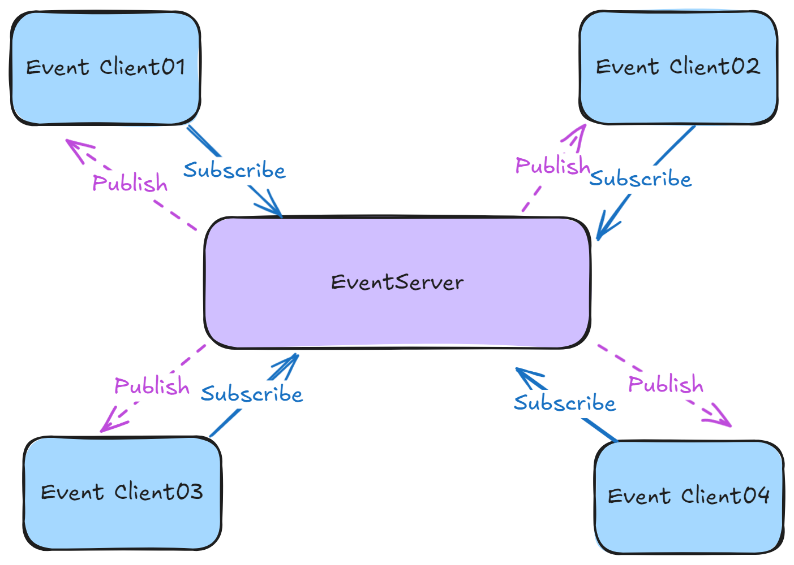
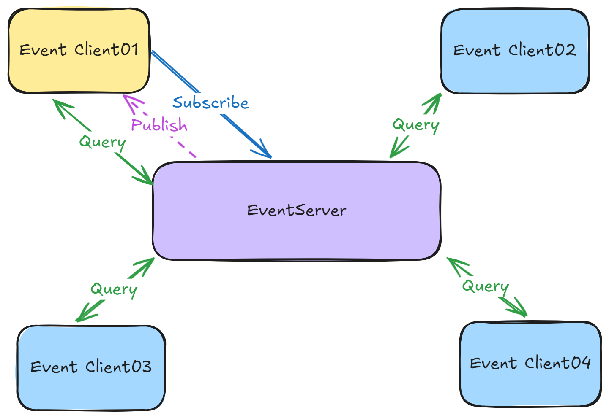

# CodeWF.EventBus.Socket
English | [简体中文](README-zh_CN.md)

**Distributed Event Bus Implemented with Sockets, Supporting CQRS, and Independent of Third-Party MQ.**

`CodeWF.EventBus.Socket` is a lightweight, Socket-based distributed event bus system designed to simplify event communication in distributed architectures. It allows processes to communicate through a publish/subscribe model without relying on external message queue services.

**Command**



**Query**



## Features

- **Lightweight**: Does not depend on any external MQ services, reducing system complexity and dependencies.

- **High Performance**: Direct communication based on Sockets provides low-latency, high-throughput message delivery.

- **Flexibility**: Supports custom event types and message handlers, making it easy to integrate into existing systems.

- **Scalability**: Supports multi-client connections, suitable for distributed system environments.

## Communication Protocol

Data interaction is conducted through the `TCP` protocol. The protocol packet structure is as follows:


## Installation

Install `CodeWF.EventBus.Socket` via the `NuGet` package manager:

```bash
Install-Package CodeWF.EventBus.Socket
```

## Server Usage

### Running the Event Service

In the server code, create and start an `EventServer` instance to listen for client connections and events:

```csharp
using CodeWF.EventBus.Socket;

// Create an event server instance
IEventServer eventServer = new EventServer();

// Start the event server, listening on the specified IP and port
eventServer.Start("127.0.0.1", 9100);
```

### Stopping the Event Service

When the event service is no longer needed, call the `Stop` method to gracefully shut down the server:

```csharp
eventServer.Stop();
```

## Client Usage

### Connecting to the Event Service

In the client code, create an `EventClient` instance and connect to the event server:

```csharp
using CodeWF.EventBus.Socket;

// Create an event client instance
IEventClient eventClient = new EventClient();

// Connect to the event server and use eventClient.ConnectStatus to check the connection status
eventClient.Connect("127.0.0.1", 9100);
```

### Subscribing to Events

Subscribe to specific types of events and specify event handling functions:

```csharp
eventClient.Subscribe<NewEmailCommand>("event.email.new", ReceiveNewEmailCommand);

private void ReceiveNewEmail(NewEmailCommand command)
{
    // Handle new email notifications
    Console.WriteLine($"Received a new email with the subject '{command.Subject}'");
}
```

### Publish(Command)

Publish events to specified topics for subscribed clients to handle:

```csharp
// Publish a new email notification event
eventClient.Publish("event.email.new", new NewEmailCommand { Subject = "Congratulations on winning the Github prize", Content = "We are delighted...", SendTime = new DateTime(2024, 7, 27) });
```

### Query

Query a specific topic requires a receiving query end (producer) subscribed to the same topic. Upon receiving the request, it publishes the query result using the same topic:

```csharp
eventClient.Subscribe<EmailQuery>("event.email.query", ReceiveEmailQuery);

private void ReceiveEmailQuery(EmailQuery query)
{
    // Execute the query request and prepare the query result
    var response = new EmailQueryResponse { Emails = EmailManager.QueryEmail(query.Subject) };
    
    // Publish the query result using the same topic
    if (_eventClient!.Publish("event.email.query", response, out var errorMessage))
    {
        Logger.Info($"Response query result: {response}");
    }
    else
    {
        Logger.Error($"Response query failed: {errorMessage}");
    }
}
```

Other ends can use the same topic to query (consumers):

```csharp
var response = _eventClient!.Query<EmailQuery, EmailQueryResponse>("event.email.query",
    new EmailQuery() { Subject = "Account" },
    out var errorMessage);
if (string.IsNullOrWhiteSpace(errorMessage) && response != null)
{
    Logger.Info($"Query event.email.query, result: {response}");
}
else
{
    Logger.Error(
        $"Query event.email.query failed: [{errorMessage}]");
}
```

### Unsubscribing from Events

When no longer needing to receive certain types of events, you can unsubscribe:

```csharp
eventClient.Unsubscribe<NewEmailNotification>("event.email.new", ReceiveNewEmail);
```

### Disconnecting from the Event Service

When event processing is complete or you need to disconnect from the server, call the `Disconnect` method:

```csharp
eventClient.Disconnect();
Console.WriteLine("Disconnected from the event service");
```

## Precautions

- Ensure that the address and port number used by the server and client are consistent, and the port is not occupied by other services.
- In a production environment, the server should be configured to listen on a public IP address or an appropriate network interface.
- Considering network exceptions and service restarts, the client may need to implement reconnection logic.
- Depending on actual needs, you can extend the `EventServer` and `EventClient` classes to support more complex features such as message encryption, authentication, and authorization.