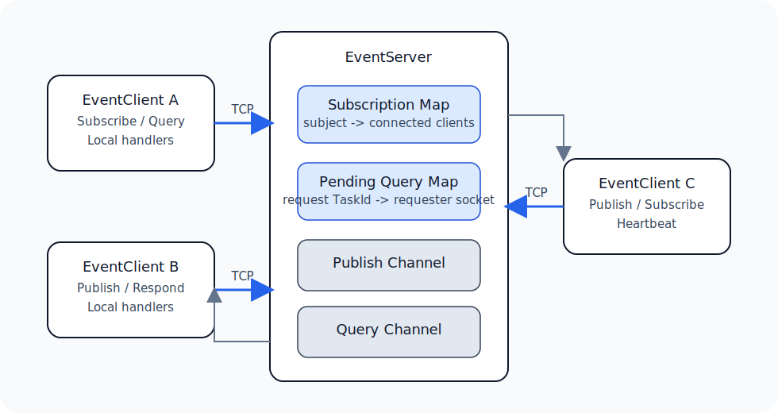
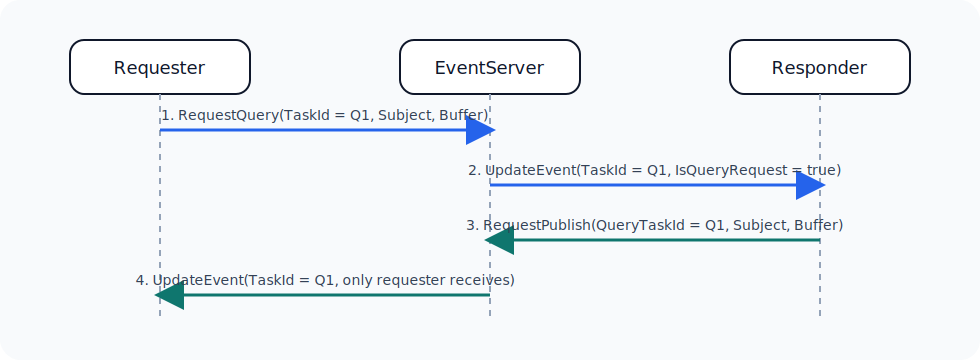

# CodeWF.EventBus.Socket 设计文档

## 概述

`CodeWF.EventBus.Socket` 是一个构建在 `CodeWF.NetWrapper` 之上的轻量级事件总线库，目标是让跨进程事件通信保持简单：

- 使用一个小型服务端负责消息路由
- 客户端可以按主题订阅并发布事件
- Query/Response 复用同一主题，但通过请求 `TaskId` 做关联
- 不依赖第三方 MQ

## 架构

### 核心组件

| 组件 | 职责 |
| --- | --- |
| `EventServer` | 接收客户端连接、维护订阅关系、转发发布消息、保存待响应查询映射 |
| `EventClient` | 管理连接、注册本地处理器、发送心跳、发起发布与查询、分发响应 |
| `CodeWF.NetWrapper` | 提供 `TcpSocketServer`、`TcpSocketClient`、传输层事件派发以及共享传输对象 |
| `CodeWF.NetWeaver` | 负责本项目和 `CodeWF.NetWrapper` 共用的协议序列化 |

## 消息类型

| 类型 | 用途 | 关键字段 |
| --- | --- | --- |
| `RequestSubscribe` | 订阅主题 | `TaskId`, `Subject` |
| `RequestUnsubscribe` | 取消订阅 | `TaskId`, `Subject` |
| `RequestPublish` | 发布事件或查询响应 | `TaskId`, `Subject`, `QueryTaskId`, `Buffer` |
| `RequestQuery` | 发起查询 | `TaskId`, `Subject`, `Buffer` |
| `UpdateEvent` | 服务端推送事件或查询 | `TaskId`, `Subject`, `IsQueryRequest`, `Buffer` |
| `ResponseCommon` | 通用服务端确认消息 | `TaskId`, `Status`, `Message` |
| `CodeWF.NetWrapper.Commands.SocketCommand` | `NetWrapper` 派发出的传输层命令对象 | `Client`, `HeadInfo` |
| `CodeWF.NetWrapper.Models.Heartbeat` | 直接复用的心跳包 | `TaskId` |

### 复用对象与自定义对象

- 直接复用 `CodeWF.NetWrapper`：`TcpSocketServer`、`TcpSocketClient`、`SocketCommand`、`Heartbeat`
- 仍保留在本项目中的事件总线协议对象：`RequestSubscribe`、`RequestUnsubscribe`、`RequestPublish`、`RequestQuery`、`UpdateEvent`、`ResponseCommon`

## 发布订阅流程

1. 客户端通过 `RequestSubscribe` 订阅某个主题。
2. 服务端把该连接保存到主题对应的订阅列表中。
3. 其他客户端发送 `RequestPublish`。
4. 服务端将消息封装为 `UpdateEvent` 并广播给该主题的订阅者。
5. 客户端在本地执行注册到该主题上的处理委托。

## 查询流程

1. 请求方发送带唯一 `TaskId` 的 `RequestQuery`。
2. 服务端按该 `TaskId` 保存待响应查询。
3. 服务端把查询转发为 `UpdateEvent`，并标记 `IsQueryRequest = true`。
4. 响应方收到后在查询处理器内继续对同一主题调用 `Publish`。
5. `EventClient` 会自动把当前查询的 `TaskId` 写入 `QueryTaskId`。
6. 服务端据此把响应准确路由回原请求方，并清理待响应项。

### 这次调整解决了什么问题

原先查询响应是按主题匹配的，同一主题下如果同时有多个查询在途，后到的请求会覆盖前一个映射，导致响应串包。现在改成按 `TaskId` 关联，同主题并发查询也能正确返回给各自的请求方。

## 运行时行为

### 连接模型

- `EventServer` 基于 `TcpSocketServer` 运行，并通过 `CodeWF.EventBus.Default` 接收入站命令。
- `EventClient` 基于 `TcpSocketClient` 运行，并通过同一个传输事件总线接收服务端响应。
- 心跳连续失败超过阈值后，客户端会尝试重连。

### 投递模型

- 消息仅保存在内存中。
- 单条连接内部的顺序尽量保持，但整体属于轻量级最佳努力投递。
- 对同一个查询 `TaskId`，只有首个有效响应会被接收。
- 超时或重复到达的查询响应会被忽略，不会误当成普通事件广播。

## 当前限制

- 不提供持久化或服务端可靠队列
- 不内置认证、鉴权与加密
- 不支持多服务端实例之间的共享状态
- 不内置指标、链路追踪和死信处理

## 适用场景

- 同机桌面程序或工具链进程之间通信
- 不值得引入完整 MQ 的内部服务协作
- 小型组件之间的轻量 CQRS 协调

## 后续可扩展方向

- 认证与授权扩展点
- TLS 或消息体加密
- 更可配置的心跳与重连策略
- 更完整的诊断与可观测能力
